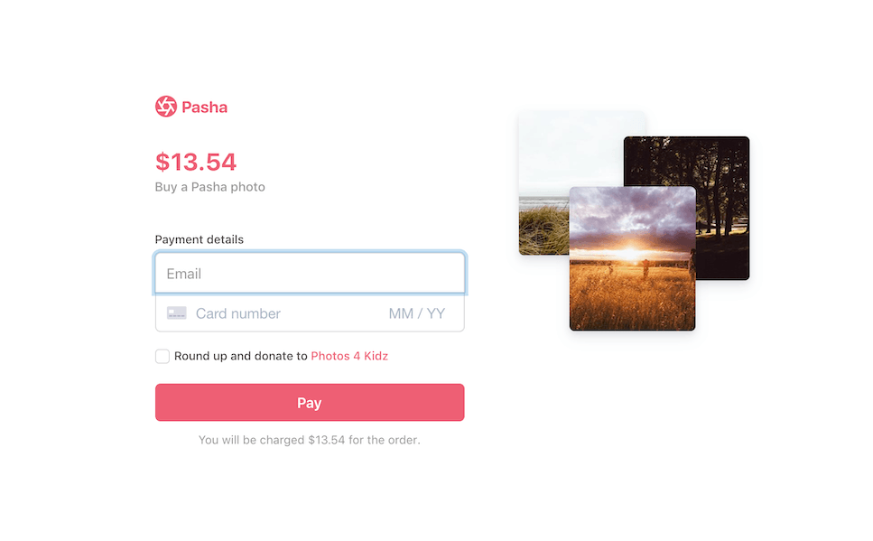

# Round up and donate

Round up and donate features are used in checkout flows to raise money for an organization or nonprofit the business wants to support. It's easy to create your own round up and donate feature using Stripe [Connect](https://stripe.com/docs/connect) and [Payments](https://stripe.com/docs/payments). A good round up and donate experience would:

1. **👥 Onboard the organization.** Use Connect to onboard the organization as a [connected account](https://stripe.com/docs/connect/accounts) to your Stripe platform account before launching the round up feature. This creates a new Stripe account for the organization so they can accept transfers and connect their bank account to receive [payouts](https://stripe.com/docs/payouts).
2. **💶 Build round up feature.** Build a feature in your checkout flow to allow a customer to round the order up to the nearest dollar or euro.
3. **➡️ Transfer donations after each purchase.** Use Stripe to transfer the donation amount to the connected account.
4. **📧 Send itemized receipts.** Send an email receipt to your customer detailing the order total + donation amounts. If multiple purchases and donations are made, send an email at the end of the year detailing how much the customer donated throughout the year.

This sample covers steps 2 and 3: calculating the new total and using the [Transfers API](https://stripe.com/docs/api/transfers) to transfer the donation to the organization's connected Stripe account.

Note that the platform and the connected account must be in the same region (e.g. both in the U.S or both in Europe) in order to use the Transfers API.

**Demo**

[View](https://lrg4x.sse.codesandbox.io/) a hosted version of the sample or [fork](https://codesandbox.io/s/round-up-and-donate-lrg4x) the sample on CodeSandbox.

The hosted demo is running in test mode -- use `4242424242424242` as a test card number with any CVC + future expiration date.

Use the `4000000000003220` test card number to trigger a 3D Secure challenge flow.

Read more about test cards on Stripe at https://stripe.com/docs/testing.




## How to run locally
Each server implementation includes 5 servers in Node, Ruby, Python, Java, and PHP in the /server/ directory. 

Follow the steps below to run locally.

**1. Clone and configure the sample**

The Stripe CLI is the fastest way to clone and configure a sample to run locally.

**Using the Stripe CLI**

If you haven't already installed the CLI, follow the [installation steps](https://github.com/stripe/stripe-cli#installation) in the project README. The CLI is useful for cloning samples and locally testing webhooks and Stripe integrations.

In your terminal shell, run the Stripe CLI command to clone the sample:

```
stripe samples create round-up-and-donate
```

The CLI will walk you through picking your integration type, server and client languages, and configuring your .env config file with your Stripe API keys.

**Installing and cloning manually**

If you do not want to use the Stripe CLI, you can manually clone and configure the sample yourself:

```
git clone https://github.com/stripe-samples/round-up-and-donate
```

Copy the .env.example file into a file named .env in the folder of the server you want to use. For example:

```
cp .env.example server/node/.env
```

You will need a Stripe account in order to run the demo. Once you set up your account, go to the Stripe [developer dashboard](https://stripe.com/docs/development/quickstart#api-keys) to find your API keys.

```
STRIPE_PUBLISHABLE_KEY=<replace-with-your-publishable-key>
STRIPE_SECRET_KEY=<replace-with-your-secret-key>
```

`STATIC_DIR` tells the server where to the client files are located and does not need to be modified unless you move the server files.

**2. Create connected account to transfer the donation to**

You will need a connected account to accept the transfers. Learn about [onboarding connected accounts](https://stripe.com/docs/connect/accounts) in the Stripe docs. 
Once you have a connected account onboarded, replace `ORGANIZATION_ACCOUNT_ID` in .env with the id of the connected account.


## FAQ
Q: Why did you pick these frameworks?

A: We chose the most minimal framework to convey the key Stripe calls and concepts you need to understand. These demos are meant as an educational tool that helps you roadmap how to integrate Stripe within your own system independent of the framework.

## Get support
If you found a bug or want to suggest a new [feature/use case/sample], please [file an issue](../../issues).

If you have questions, comments, or need help with code, we're here to help:
- on [IRC via freenode](https://webchat.freenode.net/?channel=#stripe)
- on Twitter at [@StripeDev](https://twitter.com/StripeDev)
- on Stack Overflow at the [stripe-payments](https://stackoverflow.com/tags/stripe-payments/info) tag
- by [email](mailto:support+github@stripe.com)

Sign up to [stay updated with developer news](https://go.stripe.global/dev-digest).

## Author
[@adreyfus-stripe](https://twitter.com/adrind)
